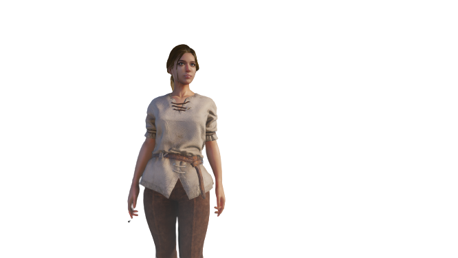

# فصل سوم: الگو طراحی دکوریتور

بیایید بدون هیچ مقدمه ای یک سناریو ساده توی هر بازی خفنی رو با هم بررسی کنیم. وقتی شما وارد هر بازی ای میشید با یک قهرمان لخت (البته بعضی بازی ها این
هیجان رو از ما میگیرن و یک لباس ژولیده بر تن قهرمان می کنند) مواجه میشید که هر چی داخل بازی پیشرفت می کنید، لباس های بهتر و خفن تری گیرتون میاد.



بیایید قبل از هر چیزی این قهرمان رو توی کدمون تعریف کنیم. طبق

```python
class Hero:
    def __init__(self, name):
        self.name = name
        self.health = 100
        self.power = 10
        self.armor = 0


```

خب حالا میخواییم این قهرانمون رو تبدیل کنیم به یک قهرمان واقعی مثل این


به نظرتون چه کاری باید بکنیم؟

خب قطعا میتونیم از هزار روش مختلف این کارو انجام بدیم ولی از اونجایی که قصد داریم الگو طراحی دکوریتور رو یاد بگیریم از این روش استفاده می کنیم.

این الگو طراحی زمانی استفاده میشه که ما میخواییم یک رفتاری رو به رفتار پایه یک کلاس اضافه کنیم. اول از همه بیایید چند متد برای گرفتن جان و قدرت و
آرمور (خداییش شما فارسیشو میدونید؟)اضافه کنیم.

```python
class Hero:
    def __init__(self, name):
        self.name = name
        self.health = 100
        self.power = 10
        self.armor = 0
        self.equipments = ""

    def get_health(self):
        return self.health

    def get_power(self):
        return self.power

    def get_armor(self):
        return self.armor

    def get_equipments(self):
        return self.equipments

```

حالا طبق قانون در اینترفیس کد بزن، بیایید برای لباس هایی که فهرمان ها میتونن بپوشن یک اینترفیس بسازیم

```python
class Equipment(ABC):
    def __init__(self, name, health, power, armor):
        self.name = name
        self.health = health
        self.power = power
        self.armor = armor

    @abctractmethod
    def get_health(self):
        pass 
        
    @abctractmethod
    def get_power(self):
        pass
    @abctractmethod
    def get_armor(self):
        pass

```

بسیار خب، حالا همه چیز برای ساختن یک کلاه خفن برای قهرمانمون آمادست، بریم که یک کلاس کانکریت کلاه و دستکش بسازیم بسازیم

```python
class PrinceHat(Equipment):
    def __init__(self):
        super().__init__("Prince Hat", 300, 100, 5)

    def get_health(self):
        return self.health
        
    def get_power(self):
        return self.power

    def get_armor(self):
        return self.armor
    
class PrinceGloves(Equipment):
    def __init__(self):
        super().__init__("Prince Gloves", 100, 3, 1)

    def get_health(self):
        return self.health
        
    def get_power(self):
        return self.power

    def get_armor(self):
        return self.armor

```

خب حالا بیایید این لباس هارو تن قهرمانون کنیم. برای اینکار ما نیاز به یک دکوریتور داریم، بریم اول پیاده سازیش رو ببینیم چون خودش باهاتون حرف میزنه.

```python

class WearEquipment(Hero):
    def __init__(self, hero, equipment):
        super(WearEquipment, self).__init__(hero)
        self.hero = hero
        self.equipment = equipment

    def get_health(self):
        return self.hero.get_health() + self.equipment.get_health()

    def get_power(self):
        return self.hero.get_power() + self.equipment.get_power()

    def get_armor(self):
        return self.hero.get_armor() + self.equipment.get_armor()

    def get_equipments(self):
        return self.hero.get_equipments() + self.equipment.name + " "

```

حالا خیلی راحت میتونیم دونه دونه لباس هارو به قهرمانمون اضافه کنیم

```python

hero = Hero("LovelyPrince")
hero = WearEquipment(hero, PrinceHat())
print(hero.get_health())
print(hero.get_power())
print(hero.get_armor())
print(hero.get_equipments())

hero = WearEquipment(hero, PrinceGloves())
print(hero.get_health())
print(hero.get_power())
print(hero.get_armor())
print(hero.get_equipments())

```

همونطوری که میبینید هر بار که یک لباسی رو به قهرمان اضافه می کنیم، اثرش رو روی جان و مال و ناموس، چیز ببخشید، جان و قدرت و آرمورش میذاره. این هم خروجی کد:


```
400
110
5
Prince Hat 
500
113
6
Prince Hat Prince Gloves

```

هر وقت میخواییم بدون تغییر در اصل یک شی، خصوصیتی رو بهش اضافه کنیم، از این الگو طراحی استفاده می کنیم. البته این تکه کد پر از ایراد و اشکاله، مثلا اگر بخواییم حالا کلاه رو در بیاریم چطور؟ ولی قصد ما اینجا آموزش این شیوه با مثال ملموس بوده.

نکته مهم اینکه دکوریتور ما باید از خود اون چیزی که قراره در بر بگیره مشتق شده باشه.

حالا نوبت شماست تا به این قهرمان ما،‌ تفنگ و کفش و کمربند اضافه کنید. حتما دست به کد بشید و صرفا با خوندن این متن اکتفا نکنید.
