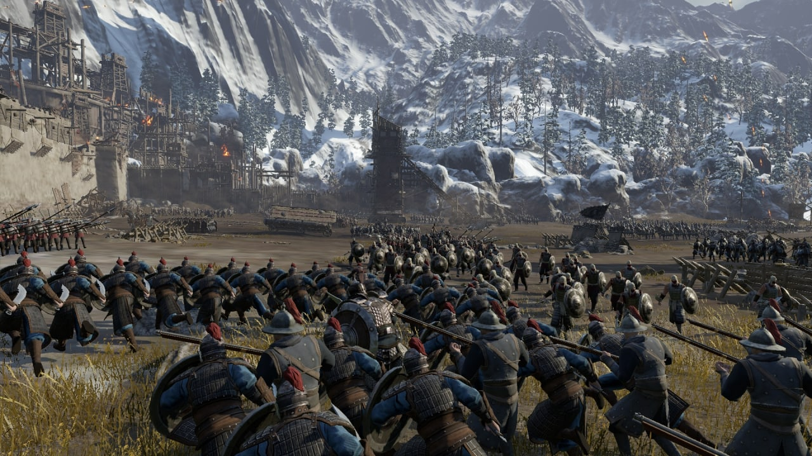
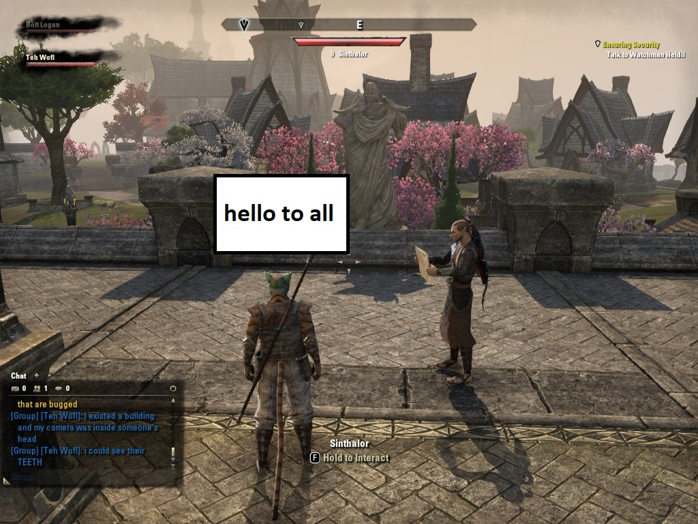

# فصل دوم: الگو مشاهده کننده

خب عملا از اسم این الگو هیچی نمیشه فهمید، ما هم قرار نیست اینجا به مغز شما فشار بیاریم تا چیزی رو متوجه بشدی پس بدون فوت وقت بریم سراغ برنامه نویسی بازی ای که داشتیم میساختیم.

بعد از اینکه ما کارکتر هارو ساختیم و یک موتور گرافیکی قوی هم براش اوردیم بالا، حالا وقت اینه که بیست تا بازیکن رو بفرستیم توی یک زمین تا با هم مبارزه کنن.

## جنگ بزرگ



یکی از اولین نیاز ها برای هر بازی گروهی امکان چت کردن با هم تیمی هاست تا بتونیم خیلی راحت تاکتیک های مختلف رو پیش بگیریم و به دژ دشمن نفوذ کنیم. خب به نظرم که کاری نداری، بیایید برای هر بازی یک شی بسازیم تا ببینیم چی کار می تونیم باهاش بکنیم.

```python
class War:
    team1 = []
    team2 = []

    def __init__(self, map_name, weather):
        self.map_name = map_name
        self.weather = weather

    @staticmethod
    def join_players(player):
        if len(War.team1) >= len(War.team2):
            War.team2.append(player)
            player.team = 2
        else:
            War.team1.append(player)
            player.team = 1
```

با این کلاس خیلی راحت هر کسی که وارد مپ ما میشه به طور مساوی توی گروه های مختلف پخش میشه، حالا برای ارسال پیام به هم تیمی هاش کافیه روی تیم خودش یک حلقه بزنیم و پیام رو براشون ارسال کنیم. بریم ببینیم یعنی چی

```python
class Player:
    def __init__(self, hero):
        self.hero = hero
        self.team = None

    def send_message(self, message):
        if self.team == 1:
            for player in War.team1:
                player.get_message(self, message)
        else:
            for player in War.team2:
                player.get_message(self, message)

    def get_message(self, sender, message):
        print(f"this is {self.hero} message tab, {sender.hero}: {message}")
```

خیلی آسون بود، نه؟ بریم ببینیم چطوری باید این کد رو اجرا کنیم؟

```python
sina = Player('Sina')
ali = Player('Ali')
reza = Player('Reza')
mohammad = Player('Mohammad')

war = War('map1', 'rainy')
war.join_players(sina)
war.join_players(ali)
war.join_players(reza)
war.join_players(mohammad)


sina.send_message('Hello to all')
```

و نتیجه نهایی:

```python
this is Ali message tab, Sina: Hello to all
this is Mohammad message tab, Sina: Hello to all
```

حالا سوالی که اینجا پیش میاد اینه که اگر یکی بخواد پیام هارو دریافت نکنه چی؟ خب شاید اولین جواب این باشه که توی یو آی نمایشش نمیدیم. مساله بعدی که پیش میاد اینه که اینجا ما داریم پیام رو توی کانال عمومی میفرستیم. شاید ما بخواییم بازیکن های اطراف ما پیام مارو ببینن.

## قابلیت تشخیص مکان بازیکن

بسیار خب، لازمه یکم توی کلاس جنگمون تغییر ایجاد کنیم.

### کلاس جنگ به کاربر ها اطلاعات میده 
```python
class War:
    team1 = []
    team2 = []

    def __init__(self, map_name, weather):
        self.map_name = map_name
        self.weather = weather

    @staticmethod
    def join_players(player):
        if len(War.team1) >= len(War.team2):
            War.team2.append(player)
            player.team = 2
        else:
            War.team1.append(player)
            player.team = 1

    @staticmethod
    def player_moves(player):
        print(f'{player.hero} moves to {player.position}')
        for team1_player in War.team1:
            team1_player.process_nearby_players(player)
        for team2_player in War.team2:
            team2_player.process_nearby_players(player)
```

متد استاتیکی که اینجا اضافه کردیم وظیفش اینه که هر زمان هر کاربری تکون خورد، این جا به جایی رو به همه کاربرهای دیگه اطلاع بده تا بتونن بر اساس اون تصمیم گیری کنند. و حالا لازمه که کلاس پلیر رو هم یه تغییری بدیم تا بتونه با ساختار جدید کار کنه و به اطرافیانش پیام بده.

### کلاس پلیر اطلاعات رو میگیره و لیست اطرافیانش رو میسازه
```python
class Player:
    def __init__(self, hero):
        self.hero = hero
        self.team = None
        self.position = [0, 0]
        self.nearby_players = []

    def send_chanel_message(self, message):
        if self.team == 1:
            for player in War.team1:
                player.get_message(self, message)
        else:
            for player in War.team2:
                player.get_message(self, message)

    def send_nearby_message(self, message):
        for player in self.nearby_players:
            player.get_message(self, message)

    def get_message(self, sender, message):
        print(f"this is {self.hero} message tab, {sender.hero}: {message}")

    def move(self, position):
        self.position = position
        War.player_moves(self)

    @staticmethod
    def calculation_distance(position1, position2):
        return math.sqrt((position1[0] - position2[0]) ** 2 + (position1[1] - position2[1]) ** 2)

    def process_nearby_players(self, player):
        if self.calculation_distance(self.position, player.position) < 5:
            self.nearby_players.append(player)
        else:
            try:
                self.nearby_players.remove(player)
            except ValueError:
                pass
```

سه تا متد جدید به کلاس قبلیمون اضافه شده و یک متد هم اسمش عوض شده، ارسال پیام رو به ارسال پیام در کانال تبدیل کردیم و یک متد برای ارسال پیام به اطرافیان اضافه کردیم.

یک متد وظیفه اش اینه که فاصله دو نقطه رو به ما بده و یک متد هم وظیفه اش اینه که اگر کاربر در شعاع ده متری ما قرار گرفت اون رو به عنوان کاربر نزدیک ثبت کنه و اگر از دایره ما خارج شد اون رو حذف کنه.

---
راهنما: دقیقا همینجا داره این الگو طراحی اتفاق می افته

---

بریم ببینیم چطوری باید از این ساختار جدید استفاده کنیم.

```python
sina = Player('Sina')
ali = Player('Ali')
reza = Player('Reza')
mohammad = Player('Mohammad')
sara = Player('Sara')
mahnaz = Player('Mahnaz')
samira = Player('Samira')
maryam = Player('Maryam')


war = War('map1', 'rainy')
war.join_players(sina)
war.join_players(ali)
war.join_players(reza)
war.join_players(mohammad)
war.join_players(sara)
war.join_players(mahnaz)
war.join_players(samira)
war.join_players(maryam)

sina.move([100, 100])
ali.move([20, 20])
reza.move([3, 3])
mohammad.move([4, 4])
sara.move([5, 5])
mahnaz.move([6, 6])
samira.move([7, 7])
maryam.move([8, 8])


maryam.send_nearby_message('Hello to all')
```
---
### اصلا هم شوخی خوبی نیست
همینجا جا داره از دوستان بابت عدم جداسازی جنسیتی معذرت خواهی کنم. طبق روال باید خانم ها در یک سرور باشن و آقایان در یک سرور دیگه ولی خب دیگه ببخشید ما یکم از نظر ذهنی عقب مونده هستیم و این دوستان رو کنار هم قرار دادیم.

---

خب حالا اگر این کد رو اجرا کنیم میبینیم که پیام هایی که مریم به اطرافیانش ارسال میکنه به همه اطرافیانش ارسال میشه و به همه غیر اطرافیانش نه. (ادبیات خودتون رو مسخره کنید کوپایلت پیشنهاد داد)

```
Sina moves to [100, 100]
Ali moves to [20, 20]
Reza moves to [3, 3]
Mohammad moves to [4, 4]
Sara moves to [5, 5]
Mahnaz moves to [6, 6]
Samira moves to [7, 7]
Maryam moves to [8, 8]
this is Reza message tab, Maryam: Hello to all
this is Maryam message tab, Maryam: Hello to all
```



نکته اینجاست که خود مریم هم باید پیامشو ببینه وگرنه میشد حذفش کرد.

تبریک می گم، بدون اینکه متوجه بشید چی شد از الگو طراحی مشاهده کننده استفاده کردیم. در این الگو طراحی ما یک شنونده داریم و یک پیام دهنده. شنونده ها برای شنیده شدن اعلان آمادگی می کنند و اسم خودشون رو در لیست فرستنده قرار میدن، فرستنده هم هر لحظه که نیاز باشه به تمام افراد لیست پیامشو ارسال می کنه. به همین راحتی.