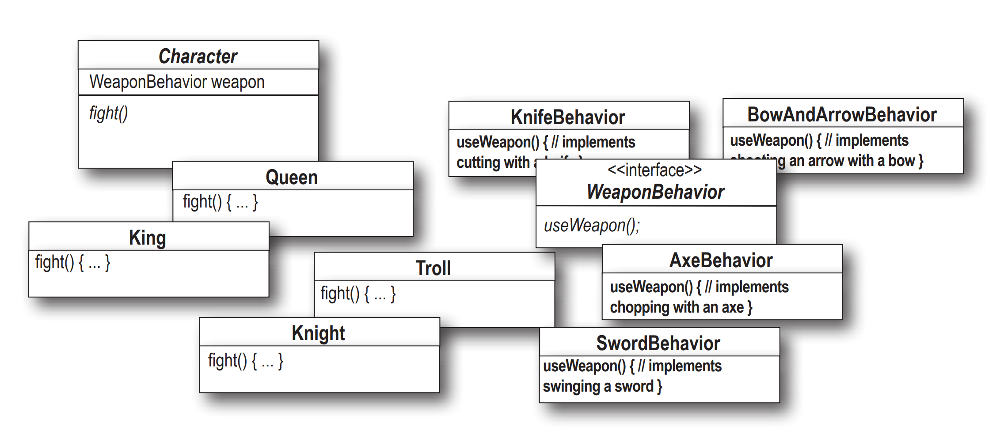

# فصل اول: الگو طراحی استراتژی
خیلی مواقع پیش میاد که ما با الگو هایی طرف هستیم که اشیائ مختلف خصوصیات مختلف و متضادی از هم دارند.

فرض کنید میخواییم یک بازی اول شخص بسازیم که میتونیم کارکتر های مختلفی داشته باشیم. 

درست حدس زدید این یک بازی خشن و پر از خون ریزیه.

خب ما توی این بازی دو مدل مختلف کارکتر داریم، یکسری از کارکتر ها با شمشیر های بلند هستد و کارکتر های بعدی تیر و کمان دارن.


خب حالا باییم یکم وارد کد نویسی بشیم.

```python
class Character(ABC):
    def __init__(self, name, level):
        self.name = name
        self.level = level

    @abstractmethod
    def attack(self):
        pass

    @abstractmethod
    def move(self):
        pass

```

خب حالا میدونیم که کارکتر های مختلفمون باید از این کلاس ارثبری کنند. دو تا کارکتر مختلف رو با هم بسازیم.

```python
class Archer(Character):
    def __init__(self, name, level):
        super().__init__(name, level)

    def attack(self):
        print(f'{self.name} attacks with a bow.')

    def move(self):
        print(f'{self.name} moves slowly.')


class Knight(Character):
    def __init__(self, name, level):
        super().__init__(name, level)

    def attack(self):
        print(f'{self.name} attacks with a sword.')

    def move(self):
        print(f'{self.name} moves quickly.')
```

تا اینجا همه چیز عالیه، ایول عجب کدی زدم. حالا که اینقدر خوب کد میزنم بذارید یه کارکتر کماندار خفن تر هم بسازم.

```python
class RoyalArcher(Character):
    def __init__(self, name, level):
        super().__init__(name, level)

    def attack(self):
        print(f'{self.name} attacks with a bow.')

    def move(self):
        print(f'{self.name} moves slowly.')
```

خیلی خوب شد، ولی صبر کن ببینم. اولا این دو تا با هم چه فرقی می کنند؟ دوما دارم یک تیکه کد رو تکرار می کنم. خب سوال اول اینکه به نظرم تیر انداز معمولی از فاصله کمتری میتونه بزنه به هدف و احتمالا دقت کمتری هم داره. خب پس بذارید اینارو هم اضافه کنم.

```python
class Character(ABC):
    def __init__(self, name, level, range=None, accuracy=None):
        self.name = name
        self.level = level
        self._range = range
        self._accuracy = accuracy

    @abstractmethod
    def attack(self):
        pass

    @abstractmethod
    def move(self):
        pass
```
اینجوری خیلی بهتر شد حالا راحت میتونم این دوتارو دوباره تعریف کنم.


```python
class Archer(Character):
    def __init__(self, name, level, range, accuracy):
        super().__init__(name, level, range, accuracy)

    def attack(self):
        print(f'{self.name} attacks with a bow. Range: {self._range}, Accuracy: {self._accuracy}')

    def move(self):
        print(f'{self.name} moves slowly.')


class RoyalArcher(Character):
    def __init__(self, name, level, range, accuracy):
        super().__init__(name, level, range, accuracy)

    def attack(self):
        print(f'{self.name} attacks with a bow. Range: {self._range}, Accuracy: {self._accuracy}')

    def move(self):
        print(f'{self.name} moves slowly.')
``` 

حالا اگر بخوام یک شوالیه تعریف کنم چی؟ اطلاعات مربوط به تیرانداز های راه دور چرا باید توی شوالیه من باشه؟ اگر یکی اشتباهی ازشون استفاده کنه چی؟ به نظرم بهتره که دو تا کلاس ابسترکت دیگه از روی کارکتر بسازم و خصوصیات هر کدوم رو به خودشون بدم.

```python
class Character(ABC):
    def __init__(self, name, level):
        self.name = name
        self.level = level

    @abstractmethod
    def attack(self):
        pass

    @abstractmethod
    def move(self):
        pass


class RangeCharacter(ABC, Character):
    def __init__(self, name, level, range, accuracy):
        super().__init__(name, level)
        self._range = range
        self._accuracy = accuracy

    @abstractmethod
    def attack(self):
        pass

    @abstractmethod
    def move(self):
        pass


class MelleCharacter(ABC, Character):
    def __init__(self, name, level, speed):
        super().__init__(name, level)
        self._speed = speed

    @abstractmethod
    def attack(self):
        pass

    @abstractmethod
    def move(self):
        pass
```

حالا خیلی راحت میتونم از روشون هر چیزی که میخوام بسازم

```python
class Archer(RangeCharacter):
    def __init__(self, name, level, range, accuracy):
        super().__init__(name, level, range, accuracy)

    def attack(self):
        print(f'{self.name} attacks with a bow. Range: {self._range}, Accuracy: {self._accuracy}')

    def move(self):
        print(f'{self.name} moves slowly.')


class Knight(MelleCharacter):
    def __init__(self, name, level, speed):
        super().__init__(name, level, speed)

    def attack(self):
        print(f'{self.name} attacks with a sword.')

    def move(self):
        print(f'{self.name} moves quickly.')
```

خیلی عالی شد، حالا میریم و ۴۸ مدل تیرانداز مختلف میسازیم. همه چیز داره عالی پیش میره تا اینکه میگیم صبر کن ببینم، اکر ما بخواییم خصوصیت آب و هوایی روی دقت و رنج تیر انداز ها تاثیر بذاره چی؟

اووووم، بذار فکر کنم. آها کاری نداره که ما یه تاثیر آب و هوایی اضافه می کنیم به کلاس اصلی و خیلی راحت تاثیرشو توی اتک ها اعمال می کنیم. اینجوری:

```python
class RangeCharacter(ABC, Character):
    def __init__(self, name, level, range, accuracy, weather_influence_factor):
        super().__init__(name, level)
        self._range = range
        self._accuracy = accuracy
        self._weather_influence_factor = weather_influence_factor

    @abstractmethod
    def attack(self):
        pass

    @abstractmethod
    def move(self):
        pass
```

کاری نداشت که. ولی صبر کن ببینم. یعنی الان باید برم این تغییر رو توی ۴۸ تا مدل کارکتری که ساختم پیاده کنم؟ آقا من نیستم خداحافظ.


## اصل اول: کامپوزیشن را به ارث بری ترجیح بده

خب به نظرم این شیوه طراحی اصلا خوب نبود. بذارید دوباره از اول فکر کنیم. ما باید تمام آن چیز هایی که ثابت هستند رو یکجا نگه داریم و متغییر هارو جدا کنیم. خب ما میدونیم که همه کارکتر های ما یک رفتاری به نام حمله یا اتک دارند. اگر ما به جای ارث بری و ساخت کلاس های جدید، رفتار های مختلف حمله رو کلاس بندی کنیم چی؟

مثلا یه چیزی توی این مایه ها:

```python
class AttachBehavior(ABC):
    
    @abstractmethod
    def attack(self):
        pass
```

بعدش بیاییم رفتار های مختلف رو بسازیم:

```python
class RangeAttack(AttachBehavior):

    def __init__(self, range, accuracy, weather_influence_factor):
        self._range = range
        self._accuracy = accuracy
        self._weather_influence_factor = weather_influence_factor

    def attack(self):
        print(f'Attacks with a bow. Range: {self._range}, Accuracy: {self._accuracy} with the weather influence factor of {self._weather_influence_factor}')


class MelleAttack(AttachBehavior):

    def __init__(self, damage_power):
        self.damage_power = damage_power

    def attack(self):
        print(f'Attacks with a sword. damage power: {self.damage_power}')

```

اینطوری میتونم خیلی راحت به هر کارکتر یک رفتار نسبت بدم و در آینده اگر بخوام تغییری توی اون رفتار ایجاد کنم دیگه نیازی نیست توی تک تک کلاس هام اینکارو بکنم. بریم با هم ببینیم:

```python
class Archer(Character):

    def __init__(self, name, level, attack_behavior):
        super().__init__(name, level)
        self._range = range
        self.attack_behavior = attack_behavior

    def attack(self):
        self.attack_behavior.attack()

    def move(self):
        print(f'{self.name} moves slowly.')
```
خب بذارید بریم و ببینیم چطوری باید از این استفاده کنیم:

```python
range_behavior = RangeAttack(10, 100, 0.5)
archer = Archer('Sina', 1, range_behavior)

archer.attack()
```

و خروجی ما:
```
Attacks with a bow. Range: 10, Accuracy: 100 with the weather influence factor of 0.5
```

به جای اینکه ما مستقیم ارث بری رو انجام بدیم و مجبور بشیم تغییرات اساسی رو توی مدل های کانکریتمون اعمال کنیم، هندل کردن این خصوصیت رو به کلاس دیگه واگذار کردیم و از خصوصیت به نام پولیمورفیزم در شی گرایی استفاده کردیم.


حالا دیگه نوبت شماست. با استفاده از مطالبی که گفته شد:

با این ها یک برنامه مشابه بسازید



